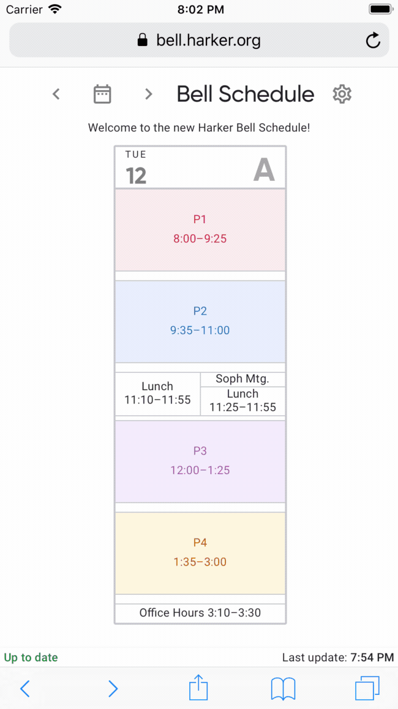
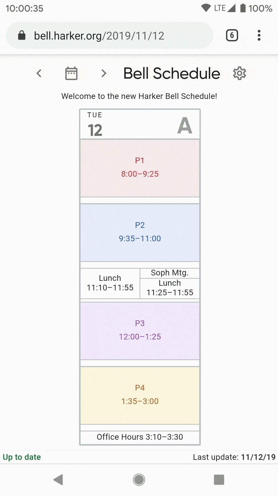
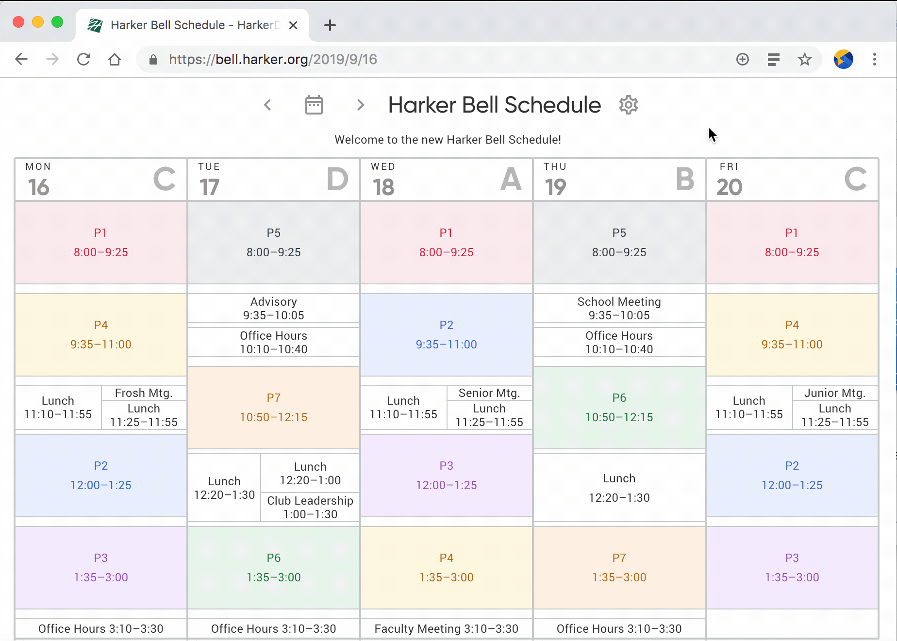

# Installing the App

The Harker Bell Schedule can be installed onto your desktop or home screen, so you can use it just like a native app.

## Instructions for iOS

By adding the web app to your home screen using Safari, you can still take advantage of special features like offline mode and real-time updates.

## Instructions for Android

## Instructions for Desktop

## Supported Browsers

Browser | Versions
------- | --------
Chrome for Desktop | 73+
Safari for iOS | 11.3+
Chrome for Android | Supported
Other Android browsers | Supported